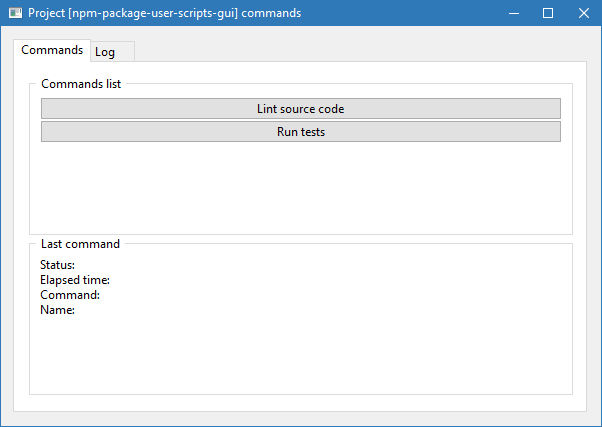
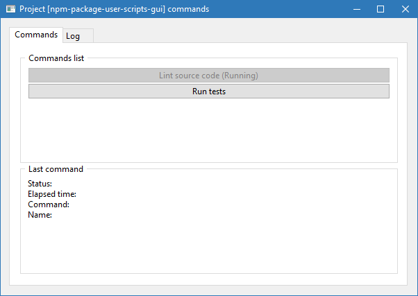
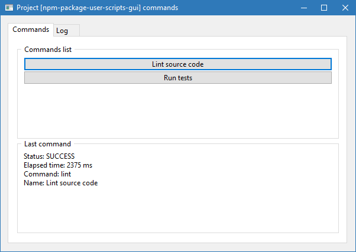
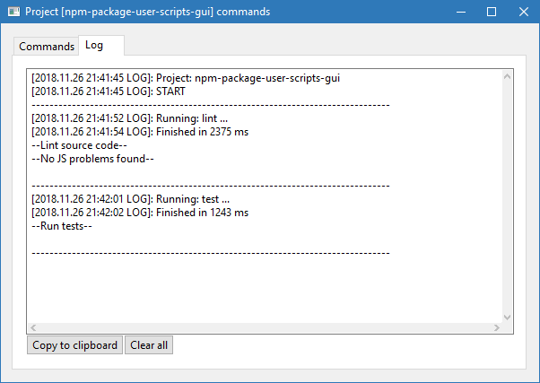
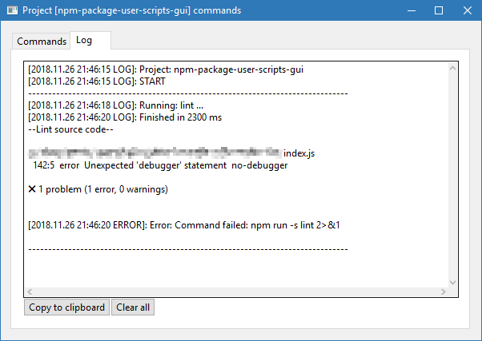

[](https://github.com/lilliputten/npm-package-user-scripts-gui/releases)
[](https://travis-ci.org/lilliputten/npm-package-user-scripts-gui)
[](https://badge.fury.io/js/npm-package-user-scripts-gui)

# npm-package-user-scripts-gui

GUI interface to `npm-package-user-scripts-list` command.

The idea of this tool came to my mind when I tried to introduce my son to the
development of node projects and manage them using npm scripts from the
console.

This script scans current project (in running path) `package.json` commands (see
[npm-package-user-scripts-list](https://github.com/lilliputten/npm-package-user-scripts-list)
for parsing details) and shows minimalistic window for interactive running your
service tasks.

Take in mind that the content of the log tab is updated only after the command
is completed. All logs are doubled on stdout.

## Requirements

See [LibUI-Node
Requirements](https://github.com/parro-it/libui-node#prerequisites) -- used
interface engine (required some build tools for compiling sources).

## Installation

For current project:

```shell
$ npm i -S npm-package-user-scripts-gui
```
Global:
```shell
$ npm i -g npm-package-user-scripts-gui
```

## Usage

In js code:

```js
const ScriptCommandsGUI = require('./');

const commandsWindow = new ScriptCommandsGUI({

  // See options reference below...

  /** Datetime format */
  dateformat: 'yyyy.mm.dd, HH:MM:ss',

  /** Minimal window width */
  width: 800,

});

commandsWindow.showWindow();
```

Windows shell command line:
```shell
$ start /B npm-package-user-scripts-gui
```

Linux/MacOS shell command line:
```shell
$ npm-package-user-scripts-gui &
```

## Options

All options are optional. :)

<!-- options begin -->
<!-- generated via `scan-options.sh` at 2018.11.27 01:36:25 -->
- **execOptions**: Exec options (for `child_process.exec`); @see [child_process.exec](https://nodejs.org/api/child_process.html#child_process_child_process_exec_command_options_callback) (default: `{}`)
- **dateformat**: Format datetime for logging; @see [felixge/node-dateformat](https://github.com/felixge/node-dateformat#usage) (default: `'yyyy.mm.dd HH:MM:ss'`)
- **width**: Minimal window width (default: `600`)
- **height**: Minimal window height (default: `200`)
- **title**: Window title (if can't to generate from `package.json`'s `name` field) (default: `'Commands'`)
- **commands**: Commands list (default: `{ test: { title: 'Test' } }`)
- **buttonSpaces**: Spaces for adding before and after button text (default: `' '`)
<!-- options end -->

## Screenshots

Initial screen:



Running command:



Successfully finished command:



Log tab:



Failed command:


Show error in the log tab:



## See also:

- [lilliputten/npm-package-user-scripts-list: List all available npm script commands](https://github.com/lilliputten/npm-package-user-scripts-list)
- [parro-it/libui-node: Node bindings for libui, an awesome native UI library for Unix, OSX and Windows](https://github.com/parro-it/libui-node)

<!--
@version 2018.11.27, 01:36
-->
